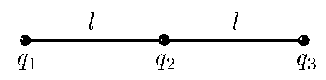

###  Условие

$6.1.7.$ Три заряда $q_1$, $q_2$, $q_3$ связаны друг с другом двумя нитями. Длина каждой нити $l$. Найдите их силу натяжения.

### Решение

В установившемся режиме заряды будут покоиться, т.е. действие всех сил на них будет скомпенсированно. Запишем второй закон Ньютона для каждого из зарядов:

$$
F_{12}+F_{13}-T_{12}=0\tag{1}
$$

$$
-F_{12}+T_{12}+F_{23}-T_{23}=0\tag{2}
$$

$$
F_{23}+F_{13}-T_{23}=0\tag{3}
$$

Расспишем силу Кулона, взаимодействия зарядов

$$
\frac{1}{4\pi\varepsilon_0}\frac{q_1q_2}{\ell^2}+\frac{1}{4\pi\varepsilon_0}\frac{q_1q_3}{(2\ell)^2}-T_{12}=0\tag{4}
$$

$$
-\frac{1}{4\pi\varepsilon_0}\frac{q_1q_2}{\ell^2}+\frac{1}{4\pi\varepsilon_0}\frac{q_2q_3}{\ell^2}+T_{12}-T_{23}=0\tag{5}
$$

$$
\frac{1}{4\pi\varepsilon_0}\frac{q_2q_3}{\ell^2}+\frac{1}{4\pi\varepsilon_0}\frac{q_1q_3}{(2\ell)^2}-T_{23}=0\tag{6}
$$

Из уравнений $(1),(3)$ найдём силу натяжения нитей $T_{12}$ и $T_{23}$

$$
\boxed{T_{12}=\frac{1}{4\pi\varepsilon_0}\frac{q_1(4q_2+q_3)}{4\ell^2};\quad T_{23}=\frac{1}{4\pi\varepsilon_0}\frac{q_3(4q_2+q_1)}{4\ell^2}}
$$

#### Ответ

$$
\frac{q_1(4q_2+q_3)}{16\pi\varepsilon_0\ell^2}\parallel \frac{q_3(4q_2+q_1)}{16\pi\varepsilon_0\ell^2}
$$