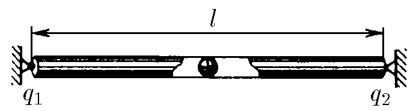

###  Условие 

$6.1.8.$ Два одинаково заряженных шарика массы $m$, подвешенных в одной точке на нитях длины $l$, разошлись так, что угол между нитями стал прямым. Определите заряд шариков. 

### Решение

Положением равновесия будет являться такая точка, в которой действие кулоновских сил скомпенсированно. При этом устойчивым будет положение, в котором небольшое смещение вызывает разность сил, возвращающую заряд в положение равновесия. Неустойчивым - то, в котором разность сил выведет заряд из положения равновесия.

Введём ось $Ox$, направленную от $q_1$ к $q_2$ и имеющую 0 в точке $q_1$, и найдём положение равновесия: $$\frac{1}{4\pi\varepsilon_0}\frac{q_1q}{x^2}-\frac{1}{4\pi\varepsilon_0}\frac{q_2q}{(\ell-x)^2}=0\quad(1)$$ Проведём математические преобразования $$\frac{q_1}{x^2}-\frac{q_2}{(\ell-x)^2}=0\quad(2)$$ $$\frac{\sqrt{q_1}}{x}=\frac{\sqrt{q_2}}{\ell-x}\quad(3)$$ Откуда найдём положение равновесия $$x=\frac{\sqrt{q_1}}{\sqrt{q_1}+\sqrt{q_2}} \cdot \ell\quad(4)$$ В случае отклонения положительного заряда из положения равновесия, например, в сторону $q_2$ сила отталкивания между $q_2$ и $q$ будет возрастать, а сила отталкивания между $q_1$ и $q$ - убывать. Таким образом, заряд будет стремиться вернуться в положение равновесия. В случае отрицательного заряда - всё наоборот ($q$ притянется к $q_2$) 

#### Ответ

$$\frac{\sqrt{q_1}}{\sqrt{q_1}+\sqrt{q_2}} \cdot \ell; \text{ да}; \text{ нет}$$ 
