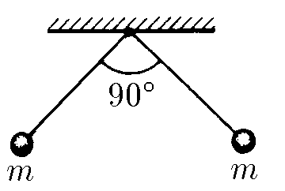

###  Условие 

$6.1.9.$ Два одинаково заряженных шарика массы $m$, подвешенных в одной точке на нитях длины $l$, разошлись так, что угол между нитями стал прямым. Определите заряд шариков. 

### Решение

В данном случае на шарики действуют 3 силы: сила натяжения $\vec{T}$, направленная вдоль нити (под углом $45^{\circ}$ к горизонту); силы тяжести $m\vec{g}$ и силы Кулона $\vec{F_k}$. 

Запишем второй закон Ньютона в проекциях на горизонтальную и вертикальную оси: $$ \left\\{ \begin{gathered} Ox: F_k-T\cdot\cos{45^{\circ}}=0\quad(1) \\\ Oy: T\cdot\sin{45^{\circ}}-mg=0\quad(2) \\\ \end{gathered} \right.$$ Отсюда следуют равенства для силы тяжести $m\vec{g}$ и силы Кулона $\vec{F_k}$ $$ \left\\{ \begin{gathered} F_k=T\cdot\cos{45^{\circ}}\quad{(3)} \\\ mg=T\cdot\sin{45^{\circ}}\quad{(4)} \\\ \end{gathered} \right.$$ Разделив одно уравнение на другое, получаем $$\frac{F_k}{mg}=\cot{45^{\circ}}=1\tag{5}$$ Данное равенство можно переписать в виде: $$\frac{1}{4\pi\varepsilon_0}\frac{q^2}{(\frac{\ell}{\cos{45^{\circ}}})^2}=mg\tag{6}$$ Откуда, выражаем заряд шариков $$q=\sqrt{4\pi\varepsilon_0mg(\sqrt{2}\ell)^2}\Rightarrow \boxed{q=\ell\sqrt{8\pi\varepsilon_0mg}}\tag{7}$$ 

#### Ответ: $q=\ell\sqrt{8\pi\varepsilon_0mg}$