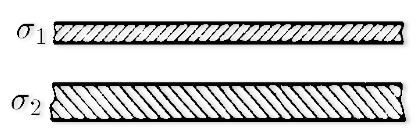

###  Условие:

$6.3.11.$ Две бесконечные проводящие изолированные плиты заряжены так, что суммарная поверхностная плотность заряда обеих сторон первой плиты равна $\sigma_1,$ а второй $\sigma_2$. Плиты параллельны друг другу. Найдите поверхностную плотность заряда на каждой стороне плит.

###  Решение:

Т.к. внутри проводника поля нет, то

$$
\sigma_1'+\sigma_1''=\sigma_1
$$

$$
\sigma_2'+\sigma_2''=\sigma_2
$$

По теореме Гаусса:

$$
-\frac{\sigma_1'}{2\varepsilon_0} + \frac{\sigma_1''}{2\varepsilon_0}+\frac{\sigma_2'}{2\varepsilon_0}+\frac{\sigma_2''}{2\varepsilon_0}=0
$$

$$
\frac{\sigma_2'}{2\varepsilon_0} - \frac{\sigma_2''}{2\varepsilon_0}+\frac{\sigma_1'}{2\varepsilon_0}+\frac{\sigma_1''}{2\varepsilon_0}=0
$$

Откуда получаем

$$
\sigma_1' - \sigma_1'' = \sigma_2
$$

$$
\sigma_2'' - \sigma_2' = \sigma_1
$$

Откуда и получаем искомые значения:

$$
\left\\{\begin{matrix} \sigma_1'=(\sigma_1+\sigma_2)/2\\\ \sigma_1''=(\sigma_1-\sigma_2)/2\\\ \sigma_2'=-(\sigma_1-\sigma_2)/2\\\ \sigma_2''=(\sigma_1+\sigma_2)/2 \\\ \end{matrix}\right.
$$

####  Ответ:

$$
\sigma_1'=(\sigma_1+\sigma_2)/2
$$

$$
\sigma_1''=(\sigma_1-\sigma_2)/2
$$

$$
\sigma_2'=-(\sigma_1-\sigma_2)/2
$$

$$
\sigma_2''=(\sigma_1+\sigma_2)/2
$$