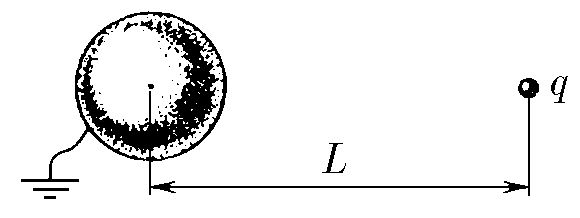

###  Условие: 

$6.3.32^{∗}.$ Чему равен заряд, индуцируемый на поверхности заземленного металлического шара точечным зарядом $q$, расположенным на расстоянии $L$ от центра шара? Радиус шара $R < L$. 

 

###  Решение: 

  

###  Ответ: $Q = −qR/L$ 

### 
