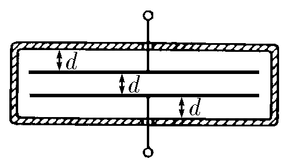
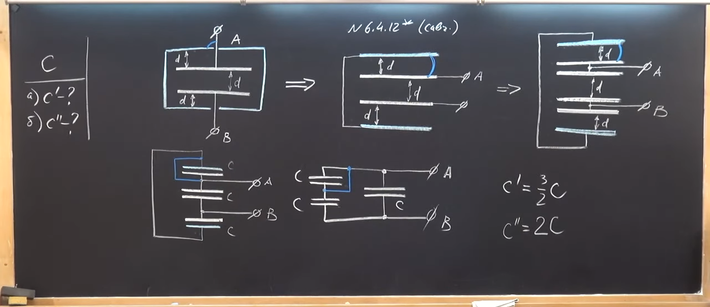

###  Условие: 

$6.4.12^{∗}.$ а. Во сколько раз изменится емкость плоского конденсатора, если поместить его в металлическую коробку? Расстояние от обкладок до стенок коробки равно расстоянию между обкладками $d$. 

б. Во сколько раз изменится емкость, если коробку соединить с одной из обкладок? 

 

###  Решение: 

 

 

###  Ответ: а. Увеличится в полтора раза. б. Увеличится в два раза 

### 
