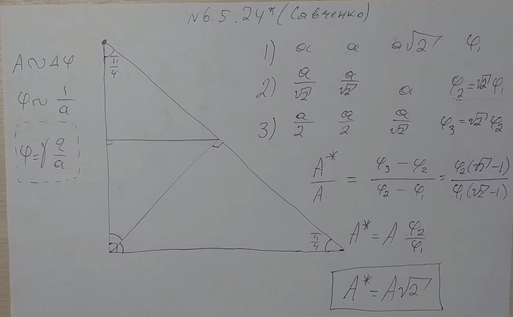

###  Условие: 

$6.5.24^{∗}.$ Равномерно заряженный лист, имеющий форму прямоугольного равнобедренного треугольника, сложили вдвое. При этом была совершена работа $A$ против сил электрического поля. Какую работу нужно совершить, чтобы еще раз так же сложить полученный треугольник? 

###  Решение: 

 

 

###  Ответ: ${A}' = \sqrt{2} A$ 

### 
