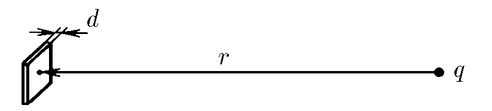
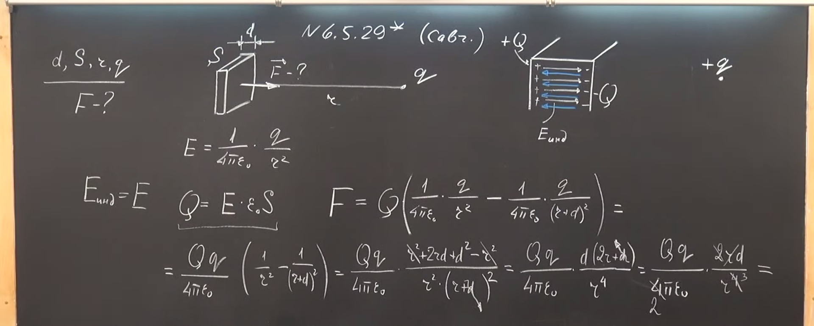
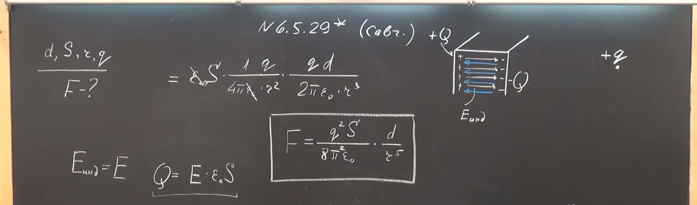

###  Условие:

$6.5.29^{∗}.$ Какой минимальный заряд $q$ нужно закрепить в нижней точке сферической полости радиуса $R$, чтобы в поле тяжести небольшой шарик массы $m$ и заряда $Q$ находился в верхней точке полости в положении устойчивого равновесия? Металлическая незаряженная пластинка площади $S$ и толщины $d$ находится на расстоянии $r$ от точечного заряда $q$ и ориентирована перпендикулярно вектору $r$. Найдите силу, с которой пластинка притягивается к заряду. Толщина пластинки меньше, а расстояние $r$ много больше линейных размеров пластинки

###  Решение:

#### Ответ: $F = \frac{q^{2}S}{8 \pi^{2} \varepsilon_{0}} \cdot \frac{d}{r^{5}}$