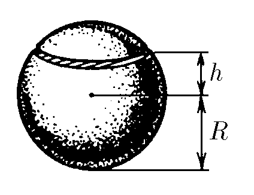

###  Условие: 

$6.5.9^{∗}.$ . Равномерно заряженная сфера радиуса $R$ разрезана на две части по плоскости, отстоящей на расстоянии $h$ от центра сферы. Найдите силу, с которой отталкиваются друг от друга эти части. Полный заряд сферы $Q$. Какой минимальный заряд нужно поместить в центр сферы, чтобы ее части не разлетались? 

 

###  Решение: 

 

####  Ответ: $F=Q^2(R^2-h^2)/(32\pi\varepsilon_0R^4);~q=-Q/2.$
