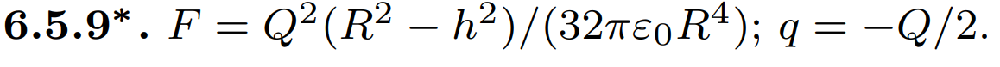

###  Условие: 

$6.5.9^{∗}.$ . Равномерно заряженная сфера радиуса $R$ разрезана на две части по плоскости, отстоящей на расстоянии $h$ от центра сферы. Найдите силу, с которой отталкиваются друг от друга эти части. Полный заряд сферы $Q$. Какой минимальный заряд нужно поместить в центр сферы, чтобы ее части не разлетались? 

 

###  Решение: 

 

###  Ответ: 

### 

 
