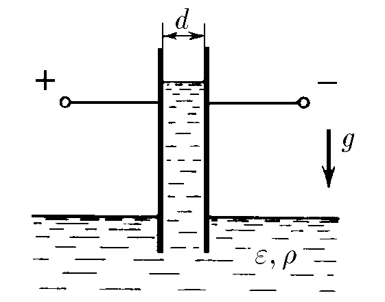
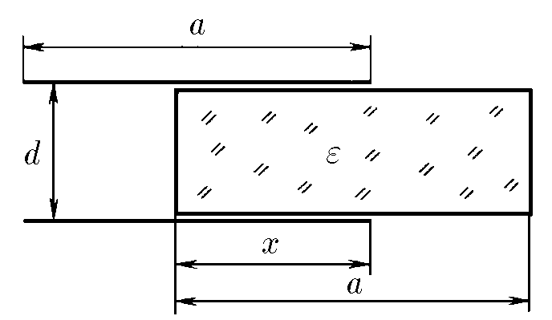

###  Условие: 

$6.6.21.$ В широкий сосуд с жидкостью ставится вертикально плоский конденсатор так, что нижняя часть пластин конденсатора погружается в жидкость. Конденсатор подключён к батарее, которая поддерживает на обкладках конденсатора разность потенциалов $V$. Расстояние между пластинами конденсатора $d$, плотность жидкости $\rho$, диэлектрическая проницаемость $\varepsilon $. Жидкость несжимаема. На какую высоту поднимется жидкость? Поверхностным натяжением пренебречь. 

 

###  Решение: 

Пусть столб жидкости поднялся на высоту $h$ Емкость конденсатора представит емкость паралельных конденсаторов $C_1$ и $C_2$ 

 

Что сводится к предыдущещей [6.6.20](/ru/6.6.20)!

Ёмкость конденсатора представит емкость паралельных конденсаторов $C_1$ и $C_2$ для обкладок размера $a × a$ 

$$C_1 = \frac{\varepsilon_0 a}{d}(a-x)$$  

$$C_2 = \frac{\varepsilon_0 a x\varepsilon }{d}$$  

Полная ёмкость системы конденсаторов:

$$C = C_1+C_2=\frac{\varepsilon_0 a}{d}(a+x(\varepsilon -1))$$  

Расчитаем энергию $E=\frac{CV^2}{2}$ этой системы:  

$$E_С=\frac{\varepsilon_0 a V^2}{2d}(a+x(\varepsilon -1))$$  

Потенциальная энергия столба жидкости составит:  

$$E_P=-\rho g da \frac{h^2}{2}$$  

Полная энергия:  

$$E=E_P+E_С=-\rho g da \frac{h^2}{2}+\frac{\varepsilon_0 a V^2}{2d}(a+h(\varepsilon -1))$$  

Энергия будет минимальна при $\frac{dE}{dh}=0$:  

$$\frac{\varepsilon_0(\varepsilon -1) a V^2}{2d}-\rho g dah=0$$  

Выражаем высоту на которую поднимется столб жидкости

$$h=\frac{\varepsilon_0 (\varepsilon -1)V^2}{2 \rho gd^2 }$$ 

####  Ответ: $h=\frac{\varepsilon_0 (\varepsilon -1)V^2}{2 \rho gd^2 }$ 
