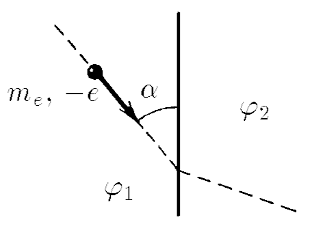

###  Условие:

$7.1.10^{∗}.$ Электрон, движущийся со скоростью $v_{1}$, переходит из области поля с потенциалом $\varphi_{1}$ в область с потенциалом $\varphi _{2}$. Под каким углом к границе раздела областей будет двигаться электрон, если он подлетел к ней под углом $\alpha$?

###  Решение:

####  Ответ: $\tan\beta = \tan\alpha\sqrt{1+ \frac{2e(\varphi _{2}-\varphi _{1})}{m_{e} v^{2} sin^{2} \alpha}}$