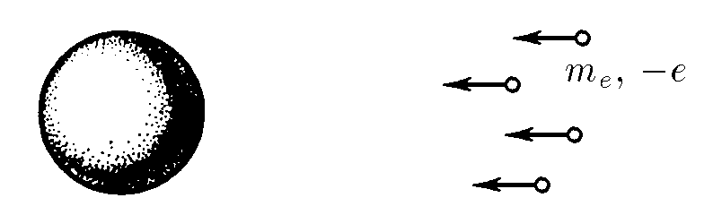
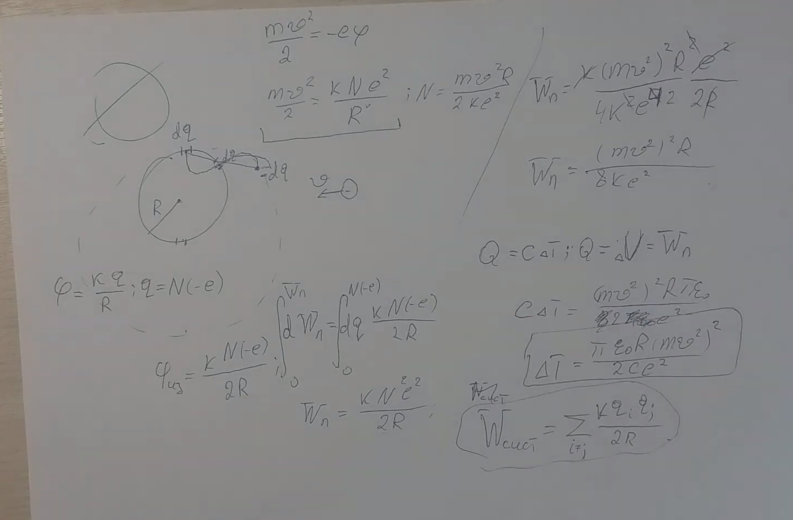

###  Условие:

$7.1.24^{∗}.$ Электроны, обладающие на бесконечности скоростью $v$, падают на металлический изолированный шар радиуса $R$. На сколько повысится температура шара, если его теплоемкость равна $C$?

###  Решение:

#### Ответ: $\Delta t = \pi\varepsilon_0R(m_ev^2)/(2e^2C)$