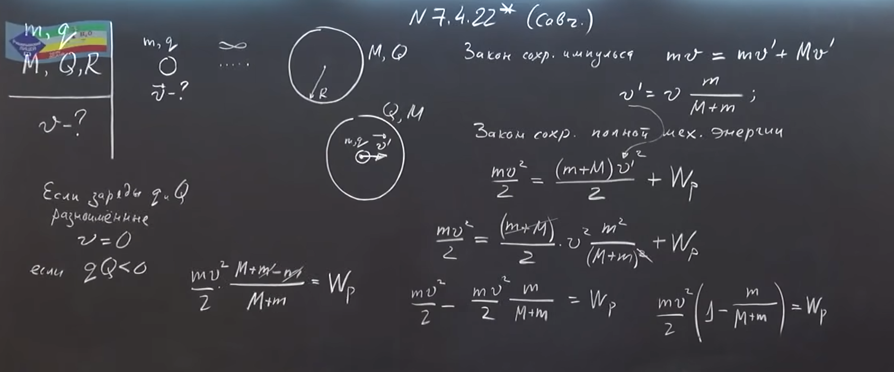
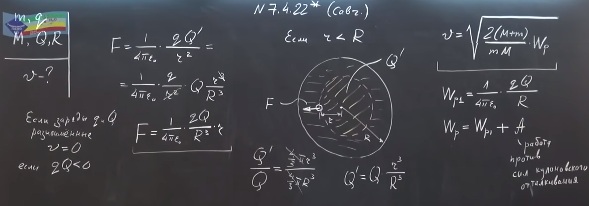
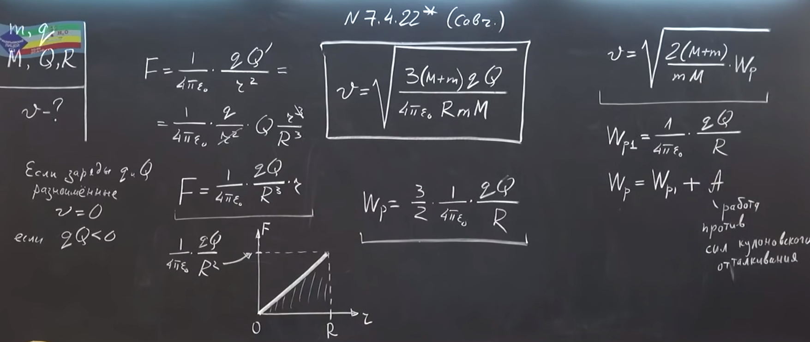

###  Условие:

$7.4.22^{∗}.$ Частица массы $m$, имеющая заряд $q$, приближается с большого расстояния к равномерно заряженному незакрепленному шару, двигаясь по направлению к центру шара. Радиус шара $R$, заряд $Q$, масса $M$. Вначале шар покоится. Какую наименьшую скорость должна иметь частица на большом расстоянии от шара, чтобы пройти через его центр?

###  Решение:

#### Ответ: $v =\sqrt{ 3qQ(m + M)/(4\pi\varepsilon_{0} mMR)}$ при $qQ > 0; \, v = 0$ при $qQ \le 0$