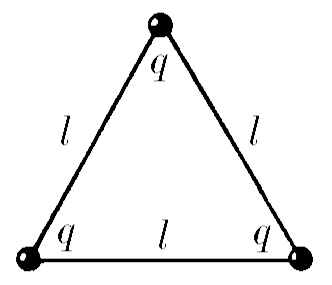
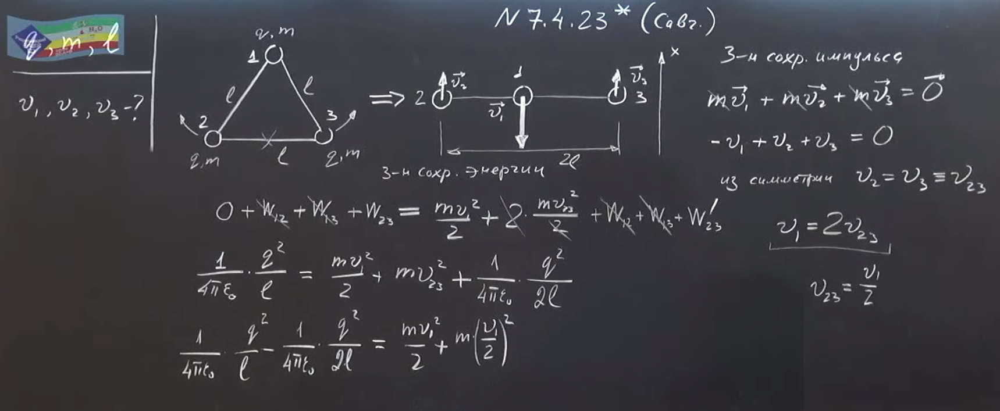
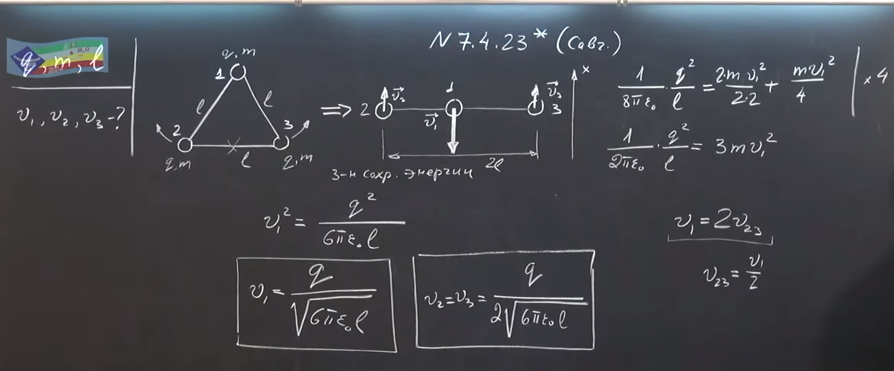

###  Условие:

$7.4.23^{∗}.$ Три одинаковых одноименно заряженных шарика, имеющие заряд $q$ и массу $m$, соединены невесомыми, нерастяжимыми и непроводящими нитями длины $l$. Одну из нитей пережигают. Определите максимальную скорость шариков.

###  Решение:

####  Ответ: $v_{ц} = \sqrt{q^{2}/(6\pi\varepsilon_{0} ml)};~v_{кр} = \sqrt{q^{2}/(24\pi\varepsilon_{0} ml)}$