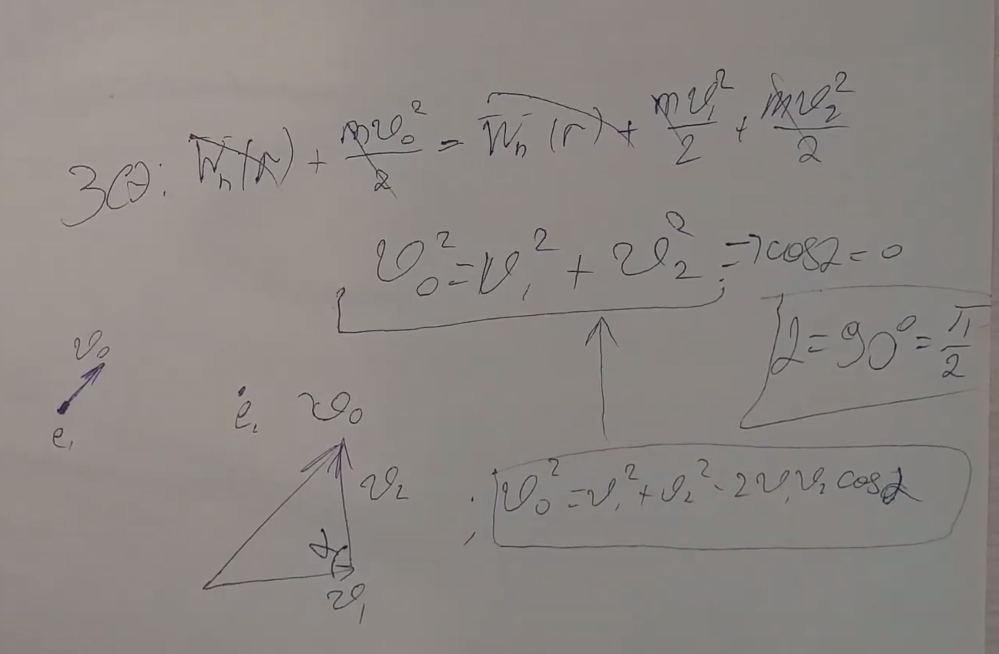

###  Условие: 

$7.4.8^{∗}.$ Два электрона находятся на расстоянии $r$ друг от друга, причем скорость одного из них равна нулю, а скорость другого направлена под острым углом к линии, соединяющей электроны. Каким будут угол между скоростями электронов, когда они вновь окажутся на расстоянии $r$ друг от друга? 

###  Решение: 

 

 

###  Ответ: $\alpha = \pi /2$ 

### 
