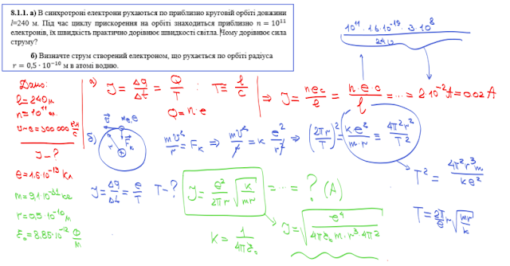
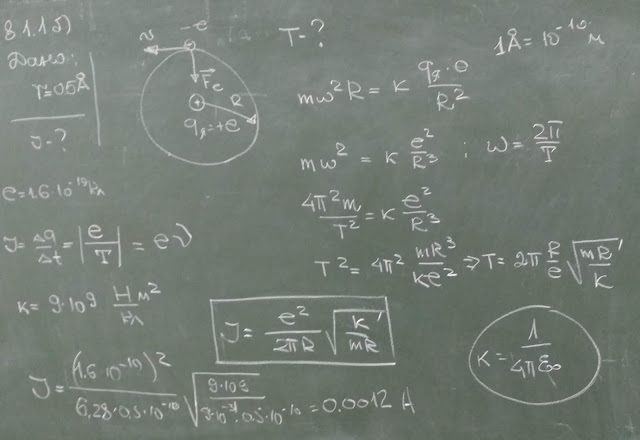
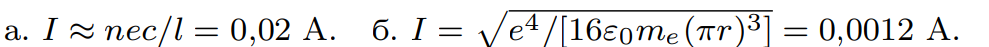

###  Условие: 

$8.1.1.$ а. В синхротроне электроны движутся по приблизительно круговой орбите длины l = 240 м. Во время цикла ускорения на орбите находится примерно $n = 1011$ электронов, их скорость практически равна скорости света. Чему равен ток? б. Определите ток, создаваемый электроном, движущимся по орбите радиуса $r = 0.5 \cdot 10^{−10} \,м$ в атоме водорода. 

###  Решение: 

 

###  Аналогичное решение: 

 

###  Ответ: 

 
