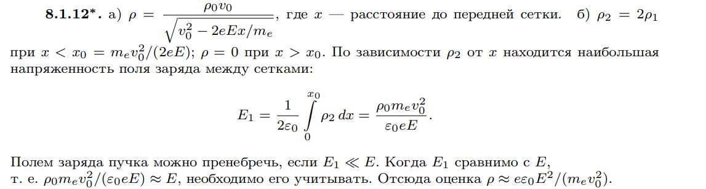

###  Условие: 

$8.1.12^*.$ Между двумя параллельными сетками создано тормозящее электрическое поле напряженности $E$. По нормали к передней сетке падает широкий пучок электронов, у которого плотность заряда $\rho_0$, а скорость $v_0$. Пренебрегая взаимодействием самих электронов, найдите распределение плотности заряда между сетками в случае, если: а) скорость электронов настолько велика, что они проходят сквозь сетки и не возвращаются; б) электроны отражаются полем. Начиная с каких значений $\rho_0$ во втором случае следует учитывать поле заряда между сетками? 

###  Решение: 

 
