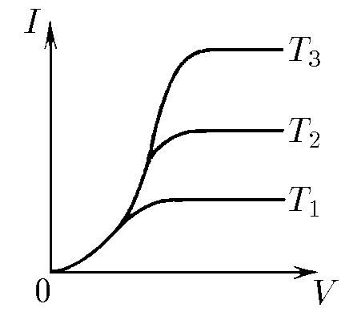

###  Условие:

$8.1.14$ На рисунке приведены три графика зависимости тока в аноде от напряжения на электродах диода, снятые при разных значениях температуры катода. Какая кривая соответствует низкотемпературному катоду, а какая высокотемпературному?

###  Решение:

Кривая $T_1$ соответствует низкотемпературному катоду, а кривая $T_3$ — высокотемпературному. Около нулевого напряжения три графика совпадают из-за образования электронного облака около катода