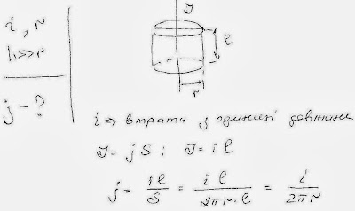

###  Условие:

$8.1.19.$ Прямолинейный провод глубоко зарыт в однородном грунте. Ток утечки с единицы длины провода равен $i$. Определите плотность тока на расстоянии $r$ от провода. Длина провода много больше $r$.

###  Решение:

#### Ответ: $j = i/(2\pi r)$