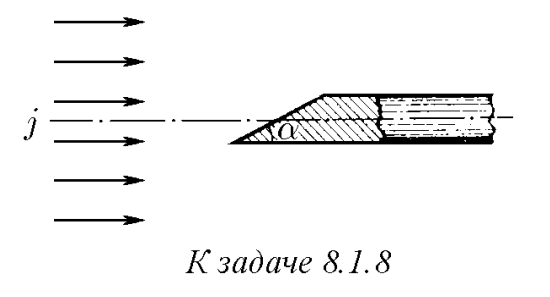

###  Условие: 

$8.1.8.$ В рентгеновской трубке пучок электронов с плотностью тока $j = 0.2 \,А/мм^2$ попадает на скошенный под углом $30^{\circ}$ торец металлического стержня. Площадь этого торца $s = 10^{−4} \,м^2$, а сам стержень расположен вдоль оси пучка. Определите ток в стержне. 

 

###  Решение: 

 

1\. Исходя из рисунка и строя проекцию, сила тока в данном случае определится уравнением $I=js \,\sin\alpha$$=10 A$ 

###  Ответ: $I = sj \sin\alpha = 10 \,А$ 
