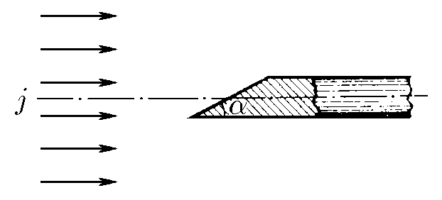
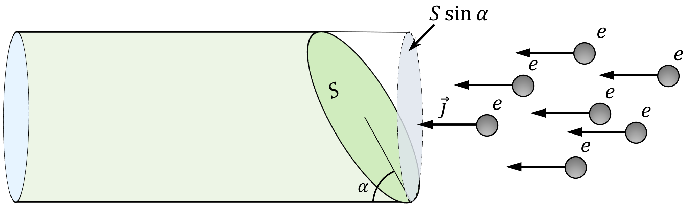

### Условие:

$8.1.8.$ В рентгеновской трубке пучок электронов с плотностью тока $j = 0.2 \,А/мм^2$ попадает на скошенный под углом $30^{\circ}$ торец металлического стержня. Площадь этого торца $S = 10^{−4} \,м^2$, а сам стержень расположен вдоль оси пучка. Определите ток в стержне.

###  Решение:

Исходя из рисунка и строя проекцию, сила тока в данном случае определится уравнением

$$
I=jS \sin\alpha=10 \mathrm{~A}
$$

#### Ответ: $I = Sj \sin\alpha = 10 \,А$