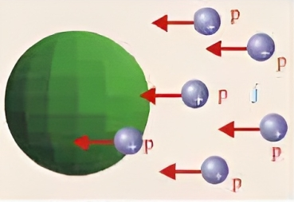

###  Условие: 

$8.1.9.$ В протонный пучок с плотностью тока $j = 1 \,мкА/см^2$ поместили металлический шар радиуса $r = 10 \,см$. Определите время, за которое шар зарядится до потенциала $V = 220 \,В$. Действием поля шара на пучок пренебречь. 

###  Решение: 

 

1\. Изменение электрического потенциала шара определяется уравнением $d\varphi \sqrt{1}{4 \pi\varepsilon_0} \cdot \frac{dQ}{r}$ откуда изменение электрического заряда шара $dQ= d\varphi4 \pi\varepsilon_0 r$ 2\. Запишем далее уравнение силы тока в следующей форме $I= \frac{dQ}{dt}=js;\,$ $\,\,\frac{4 \pi\varepsilon_0 rd\varphi}{dt} = \pi r^2j$ откуда $\tau = \frac{4 \pi\varepsilon_0 \varphi}{rj} = 8 \,мкс$ 

###  Ответ: $t = 8 \cdot 10^{−6} \,с$ 
