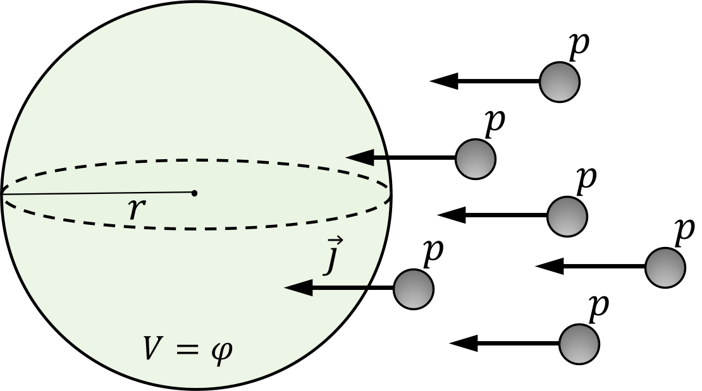

###  Условие:

$8.1.9.$ В протонный пучок с плотностью тока $j = 1 \,мкА/см^2$ поместили металлический шар радиуса $r = 10 \,см$. Определите время, за которое шар зарядится до потенциала $V = 220 \,В$. Действием поля шара на пучок пренебречь.

###  Решение:

Изменение электрического потенциала шара определяется уравнением

$$
d\varphi = \frac{1}{4 \pi\varepsilon_0} \cdot \frac{dQ}{r}\tag{1}
$$

откуда изменение электрического заряда шара

$$
dQ= 4 \pi\varepsilon_0 r ~d\varphi\tag{2}
$$

Запишем далее уравнение силы тока в следующей форме

$$
I= \frac{dQ}{dt}=js\tag{3}
$$

Подставляем значение для изменения электрического заряда шара $dQ$ из $(2)$ в уравнение для силы тока $(3)$:

$$
\frac{4 \pi\varepsilon_0 rd\varphi}{dt} = \pi r^2j\tag{4}
$$

откуда

$$
\tau = \frac{4 \pi\varepsilon_0 \varphi}{rj} = 8 \mathrm{~мкс}\tag{5}
$$

#### Ответ: $t = 8 \cdot 10^{−6} \,с$