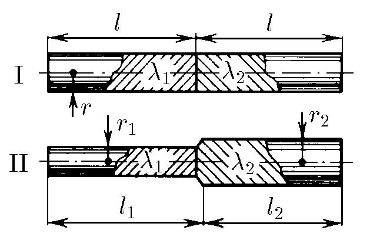

###  Условие: 

$8.2.14.$ Из металлов с удельной проводимостью $λ_1$ и $λ_2$ изготовили длинные стержни и соединили их так, как показано на рисунке. На крайних торцах поддерживается разность потенциалов $V$. Определите сопротивление соединенных стержней и токи в них. 

###  Решение: 

По определению, удельное сопротивление связано с удельной проводимостью формулой:

$$\rho = \frac{1}{\lambda}$$ 

Сопротивление цилиндрического проводника с площадью поперечного сечения $S$ определяется как:

$$R = \rho\frac{l}{S}=\frac{l}{\lambda S}=\frac{1}{\lambda} \cdot \frac{l}{\pi r^2}\tag{1}$$ 

Для случая $\mathrm{II}$, два проводника соединённых последовательно имеют полное сопротивление равное сумме сопротивлений каждого участка:

$$R_\mathrm{II}=R_{r_1}+R_{r_2}$$

Из $(1)$: 

$$R_{r_1}=\frac{1}{\lambda_1 } \cdot \frac{l_1}{\pi r_1^2};~R_{r_2}=\frac{1}{\lambda_2 } \cdot \frac{l_2}{\pi r_2^2}$$ 

Тогда 

$$R_\mathrm{II} = \frac{1}{\pi}\left(\frac{l_1}{r_1^2\lambda_1}+\frac{l_2}{r_2^2\lambda_2}\right)\tag{2}$$ 

Случай $\mathrm{II}$ более общий случай случая $\mathrm{I}$ при ($r=r_1=r_2$ и $l=l_1=l_2$): 

$$R_\mathrm{II}=R_{r_1}+R_{r_2}$$ 

Уравнение $(2)$ для данного случая: 

$$R_\mathrm{I}=\frac{l}{\pi r^2}\left(\frac{1}{\lambda_1}+\frac{1}{\lambda_2}\right)$$ 

Из закона Ома: 

$$I_\mathrm{I}=V/R_\mathrm{I}; ~I_\mathrm{II}=V/R_\mathrm{II}$$ 

####  Ответ: $R_\mathrm{I} = \frac{l}{\pi r^2}\left(\frac{1}{\lambda_1}+\frac{1}{\lambda_2}\right)$, $ R_\mathrm{II} = \frac{1}{\pi}\left(\frac{l_1}{r_1^2\lambda_1}+\frac{l_2}{r_2^2\lambda_2}\right){;}$ $I_\mathrm{I} = V/R_1,$ $I_\mathrm{II} = V/R_\mathrm{II}$ при $|r_2-r_1|\ll l_1,l_2.$
