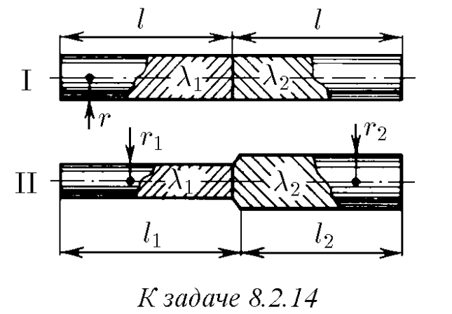
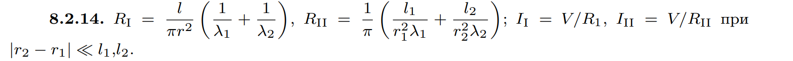

###  Условие: 

$8.2.14.$ Из металлов с удельной проводимостью $λ_1$ и $λ_2$ изготовили длинные стержни и соединили их так, как показано на рисунке. На крайних торцах поддерживается разность потенциалов $V$. Определите сопротивление соединенных стержней и токи в них. 

 

###  Решение: 

Удельное сопротивление равно: $\rho = \frac{1}{\lambda}$ Сопротивление $R = \rho\frac{l}{S}$$=\frac{l}{\lambda S}$$=\frac{1}{\lambda} \cdot \frac{l}{\pi r^2}\quad(1)$ Для случая II: $R_{II}=R_{r_1}+R_{r_2}$ Из $(1):$ $\;R_{r_1}=\frac{1}{\lambda_1 } \cdot \frac{l_1}{\pi r_1^2};$ $\;R_{r_2}=\frac{1}{\lambda_2 } \cdot \frac{l_2}{\pi r_2^2}$ Тогда $R_{II}=\frac{1}{\lambda_1 } \cdot \frac{l_1}{\pi r_1^2}+\frac{1}{\lambda_2 } \cdot \frac{l_2}{\pi r_2^2}$$=\frac{1}{\pi}(\frac{l_1}{r_1^2\lambda_1}+\frac{l_2}{r_2^2\lambda_2})\quad(2)$ Случай II более общий случай случая I: $R_{II}=R_{r_1}+R_{r_2}$ $r_1=r_2=r$ $l_1=l_2=l$ Формула $(2)$ для данного случая: $R_{I}=\frac{1}{\pi}(\frac{l_1}{r_1^2\lambda_1}+\frac{l_2}{r_2^2\lambda_2})$$=\frac{l}{\pi r^2}(\frac{1}{\lambda_1}+\frac{1}{\lambda_2})$ Из закона Ома: $I_I=v/R_I$ $I_{II}=v/R_{II}$ 

###  Ответ: 

 
