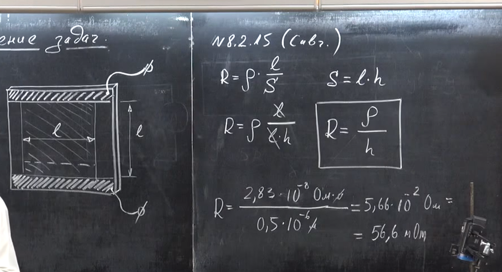

###  Условие:

$8.2.15.$ Экспериментатор хочет приготовить слой алюминия толщины $500 \,нм$, напыляя его в вакууме на чистую поверхность стеклянной пластинки. Сначала он наносит два довольно толстых слоя алюминия, оставляя в центре пластинки полоску чистой поверхности, закрытую маской. Потом, используя другую маску, он напыляет на стекло в поперечном направлении полоску алюминия той же ширины, что и чистая полоска. При этом толстые слои используются как выводы для измерения сопротивления напыляемого слоя. При каком сопротивлении слоя напыление следует остановить, если удельное сопротивление алюминия при комнатной температуре равно $2.83 \cdot 10^{−8} \,Ом \cdot м$?

###  Решение:

#### Ответ: $R = 0.0566 \,Ом$