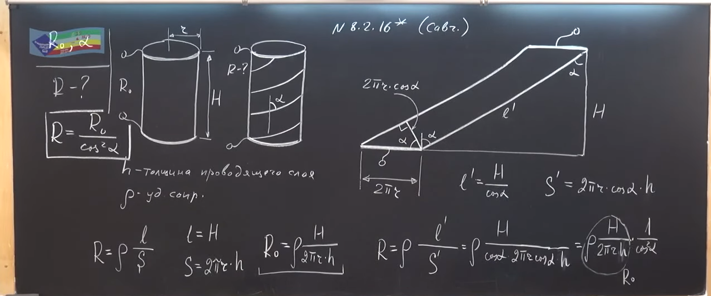

###  Условие:

$8.2.16^{∗}.$ Длинная цилиндрическая трубка из изолятора покрыта тонким проводящим слоем. Сопротивление между торцами трубки $R_{0}$. Проводящий слой прорезают тонким резцом по винтовой линии, идущей под углом $\alpha$ к образующей трубке. После этого подсоединяют контакты и наносят изолирующее покрытие. Определите сопротивление получившегося резистора.

###  Решение:

#### Ответ: $R = \frac{R_{0}}{\cos^{2} \alpha}$