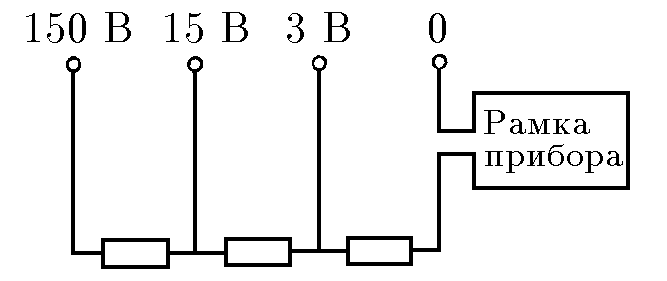
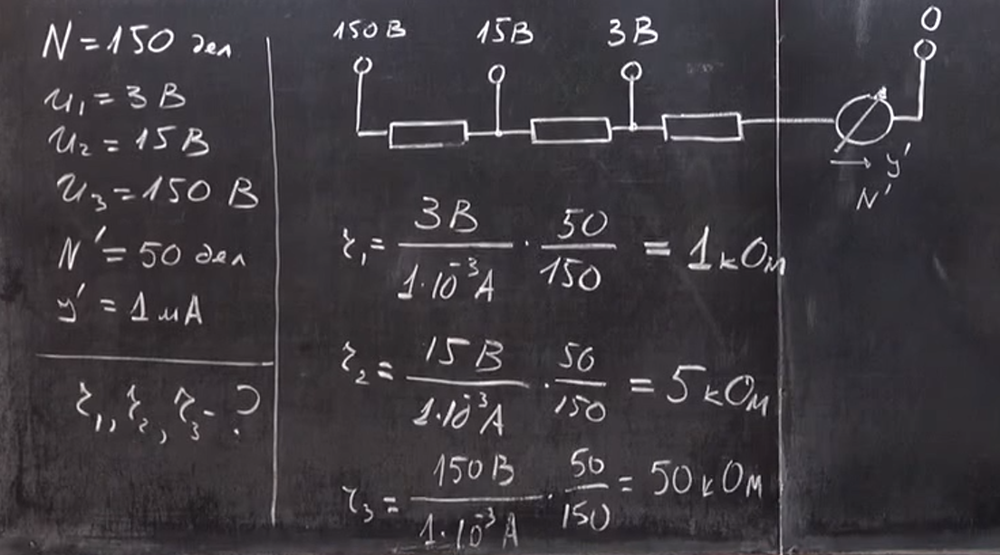

###  Условие: 

$8.3.1.$ Шкала вольтметра имеет $150$ делений. Вольтметр имеет четыре клеммы, рассчитанные на измерение напряжения до $3{,}15$ и $150 \,В$. Стрелка прибора отклоняется на $50$ делений при прохождении через него тока $1 \,мА$.Каково внутреннее сопротивление прибора при включении его на различные диапазоны? 

###  Решение: 

 

 

###  Ответ: $r = 1.5 \,и \,50 \,кОм$. 
