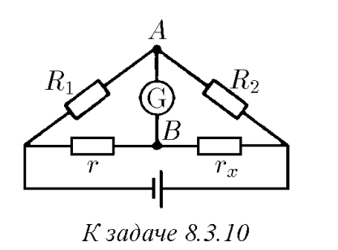
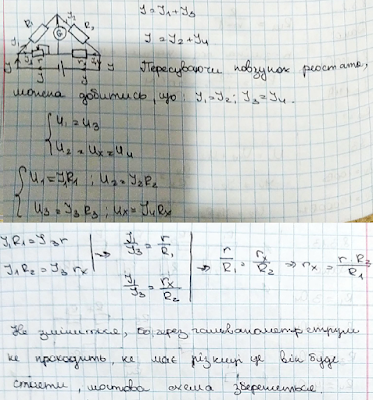

###  Условие: 

$8.3.10.$ В мосте Уитстона сопротивления подбирают таким образом, что чувствительный гальванометр, подключенный к точкам $A$ и $B$, показывает нуль. Считая сопротивления $R_1$, $R_2$, $r$ известными, определите сопротивление $r_x$. Если поменять местами батарею и гальванометр, то снова получится мостовая схема. Сохраняется ли баланс в новой схеме? 

 

###  Решение: 

 

###  Ответ: $r_x = rR_2/R_1$; сохраняется. 
