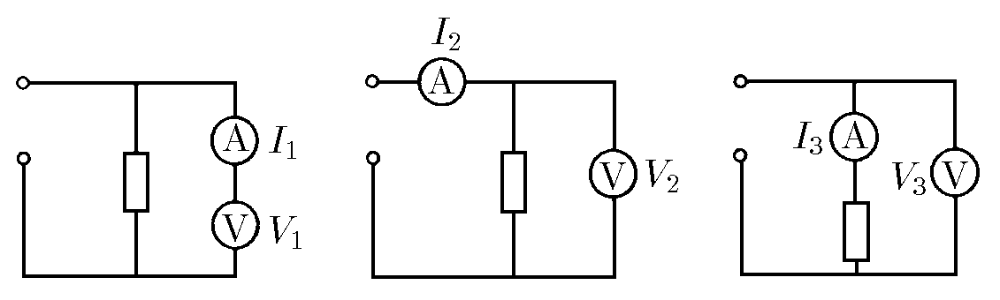

###  Условие: 

$8.3.11.$ Одни и те же приборы при присоединении их по трем разным схемам дают следующие показания: $V_1,$ $I_1;$ $V_2,$ $I_2;$ $V_3,$ $I_3.$ Найдите сопротивление вольтметра, резистора и амперметра. Напряжение, подаваемое на эти схемы, не обязательно одинаково. 

###  Решение: 

В первой схеме вольтметр напрямую подключен к источнику напряжения. Его сопротивление можно выразить как:

$$R_{V} = \frac{U_{1} }{I_{1}}$$ 

Во второй схеме резистор и вольтметр подключены параллельно. Ток $I_2$, подаваемый на схему, делится на ток через резистор $I_R$ и ток через вольтметр $I_V$:
 
$$I_{2} = I_{R} + I_{V}$$

Отсюда ток через резистор:

$$I_{R} = I_{2} - I_{V} = I_{2} - \frac{U_{2} }{R_{V} }$$ 

Теперь сопротивление резистора $R$ выражается как:

$$R = \frac{U_{2} }{I_{R} } = \frac{U_{2} }{I_{2} - \frac{U_{2} }{R_{V} } } $$

Подставим сопротивление вольтметра $R_V = \frac{U_1}{I_1}$:

$$R= \frac{U_{2} }{I_{2} - I_{1} \frac{U_{2} }{U_{1} } }$$ 

Приведем к удобному виду:

$$
R = \frac{U_{2}U_{1} }{I_{2}U_{1} - I_{1}U_{2} }
$$

В третьей схеме амперметр подключен последовательно с резистором. Напряжение $U_3$ распределяется между резистором $R$ и амперметром $R_A$:

$$U_{3} = I_{3} (R_{A} + R)$$ 

Отсюда выражаем $R_A$:

$$R_{A} = \frac{U_{3} }{I_{3} } - R $$

Подставим ранее полученное $R = \frac{U_{2}U_{1} }{I_{2}U_{1} - I_{1}U_{2} }$:

$$R_A = \frac{U_{3} }{I_{3} } - \frac{U_{2}U_{1} }{I_{2}U_{1} - I_{1}U_{2} } $$

Приводя к общему знаменателю, упрощаем полученное выражение:

$$R_A = \frac{U_{1}U_{3}I_{2} - U_{3}U_{2}I_{1} - U_{2}U_{1}I_{3} }{I_{3} (U_{1}I_{2} - U_{2}I_{1} ) }$$

####  Ответ: 

$$
R_\mathrm{в}=V_1/I_1;R=V_2V_1/(I_2V_1-I_1V_2);
$$

$$
R_A=(V_1V_3I_2-V_3V_2I_1-V_2V_1I_3)/I_3(V_1I_2-V_2I_1)
$$