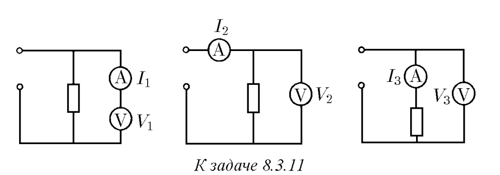
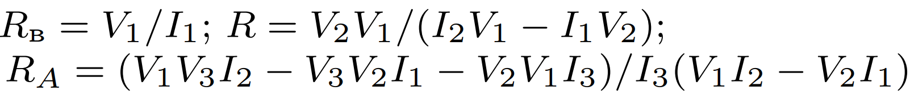

###  Условие: 

$8.3.11.$ Одни и те же приборы при присоединении их по трем разным схемам дают следующие показания: $V_1,$ $I_1;$ $V_2,$ $I_2;$ $V_3,$ $I_3.$ Найдите сопротивление вольтметра, резистора и амперметра. Напряжение, подаваемое на эти схемы, не обязательно одинаково. 

 

###  Решение: 

Из данных для первой схемы найдем сопротивление вольтметра: $R_{V} = \frac{U_{1} }{I_{1}}$ Для второй схемы можно записать $I_{2} = I_{R} + I_{V}$, или $I_{R} $$= I_{2} - I_{V} $$= I_{2} - \frac{U_{2} }{R_{V} }$ Отсюда находим $R = \frac{U_{2} }{I_{R} } $$= \frac{U_{2} }{I_{2} - \frac{U_{2} }{R_{V} } } $$= \frac{U_{2} }{I_{2} - I_{1} \frac{U_{2} }{U_{1} } } $$= \frac{U_{2}U_{1} }{I_{2}U_{1} - I_{1}U_{2} }$ В третьем случае $U_{3} = I_{3} (R_{A} + R)$, откуда получаем $R_{A} = \frac{U_{3} }{I_{3} } - R $$= \frac{U_{3} }{I_{3} } - \frac{U_{2}U_{1} }{I_{2}U_{1} - I_{1}U_{2} } $$= \frac{U_{1}U_{3}I_{2} - U_{3}U_{2}I_{1} - U_{2}U_{1}I_{3} }{I_{3} (U_{1}I_{2} - U_{2}I_{1} ) }$ 

###  Ответ: 

 
