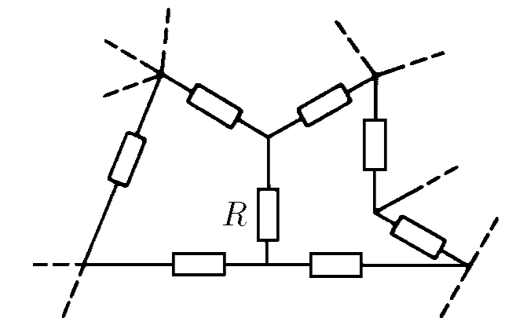
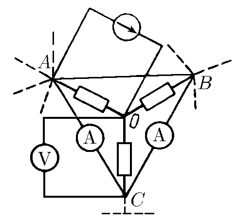

###  Условие: 

$8.3.12^*.$ Участок схемы состоит из неизвестных сопротивлений. Как, имея амперметры, вольтметр, батарею и соединительные провода, измерить сопротивление $R$, не разрывая ни одного контакта в схеме? 

###  Решение: 

Приведем часть схемы, включающую искомое сопротивление. К узлам $A$ и $O$ подключим батарею, а к узлам $C$ и $O$ — вольтметр, к узлам $C$ и $A,$ $C$ и $B$ — амперметры, а узлы $A$ и $B$ соединены проводом. Ток через сопротивление $R$ равен $IC_A + IC_B$. Тогда $R = V /(IC_A + IC_B)$, где $V$ — показание вольтметра. 
