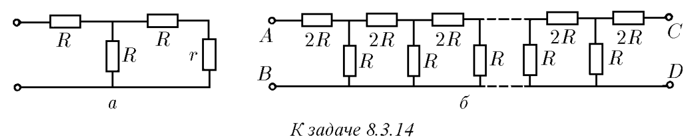
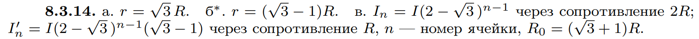

###  Условие: 

$8.3.14.$ а. Каким должно быть сопротивление $r$, чтобы входное сопротивление между клеммами было равно тоже $r$? б*. Какое сопротивление $r$ нужно присоединить к клеммам $C$ и $D$, чтобы сопротивление всей цепочки между клеммами $A$ и $B$ не зависело от числа элементарных ячеек? в. Полный ток в цепи равен $I$. Определите токи в $n$-й ячейке, если цепочка сопротивлений бесконечна. Чему равно сопротивление такой цепочки? 

 

###  Решение: 

 

 

###  Ответ: 

 
