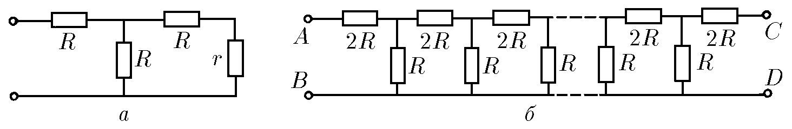
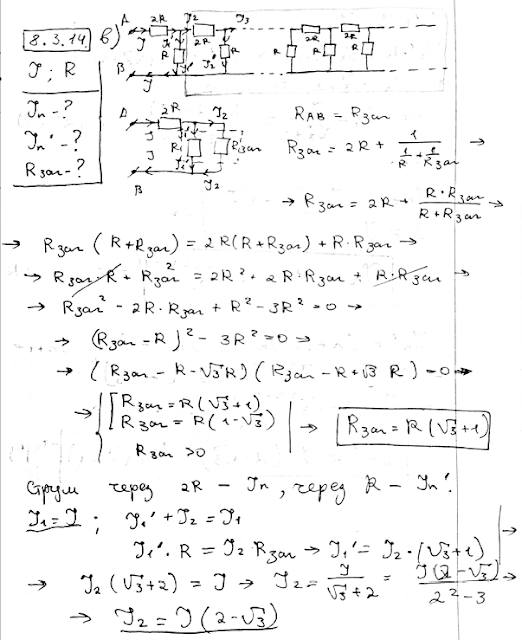
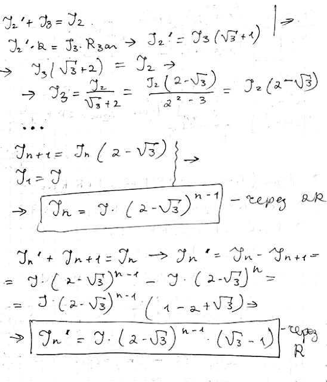

###  Условие:

$8.3.14.$ а. Каким должно быть сопротивление $r$, чтобы входное сопротивление между клеммами было равно тоже $r$? б*. Какое сопротивление $r$ нужно присоединить к клеммам $C$ и $D$, чтобы сопротивление всей цепочки между клеммами $A$ и $B$ не зависело от числа элементарных ячеек? в. Полный ток в цепи равен $I$. Определите токи в $n$-й ячейке, если цепочка сопротивлений бесконечна. Чему равно сопротивление такой цепочки?

###  Решение:

###  Ответ:

a. $r=\sqrt{3}\mathrm{~}R.$ б* $\mathrm{~}r=(\sqrt{3}-1)R.$ в. $I_n=I(2-\sqrt{3})^{n-1}$ через сопротивление $2R$; $I_n^{\prime}=I(2-\sqrt{3})^{n-1}(\sqrt{3}-1)$ через сопротивление $R,\mathrm{~}n$—номер ячейки, $R_0=(\sqrt{3}+1)R$