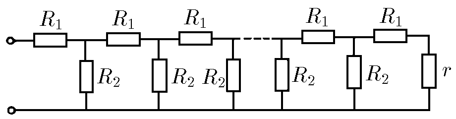
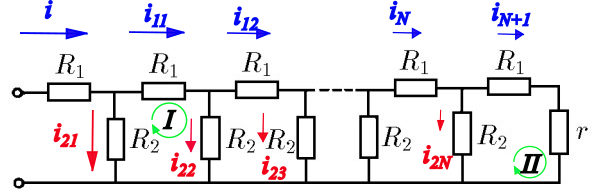

###  Условие:

$8.3.15^*.$ Аттенюатор представляет собой делитель напряжения, схема которого представлена на рисунке. Каковы должны быть сопротивления $R_1$ и $R_2$, чтобы на каждом следующем сопротивлении $R_1$ напряжение было в десять раз меньше, чем на предыдущем?

###  Решение:

Рассмотрим следующий рисунок

Применение второго закона Кирхгофа. Для контура $I$

$$
-i_{11}R_1-i_{22}R_2+i_{21}R_2=0
$$

$$
-i_{11}R_1+R_2(i_{21}-i_{22})=0 \quad(1)
$$

Так как $i_{11}R_1 = 10 i_{12}R_1$, то есть, $i_{1n} = 10 i_{1(n+1)}$, следовательно

$$
i_{1n} = \frac{i_{11}}{10^{n-1}} \;\forall~n\geq2 \quad(2)
$$

Для контура $II$ и согласно $(2)$

$$
-i_{N+1}(R_1+r)+i_{2N}R_2=0
$$

$$
-\frac{i_{11}}{10^{N-1}}(R_1+r)+i_{2N}R_2=0 \quad(3)
$$

Для последующих бифуркаций (с применением первого закона Кирхгофа)

$$
i_{11} = i_{12}+i_{22}
$$

$$
i_{22} = i_{11}-i_{12}
$$

Таким образом,

$$
i_{2n} = i_{1(n-1)}-i_{1n} \;\forall~n\geq2 \quad(4)
$$

Согласно $(2)$, изменим $(4)$

$$
i_{2n} = \frac{i_{11}}{10^{n-2}}-\frac{i_{11}}{10^{n-1}}
$$

$$
i_{2n} = \frac{9i_{11}}{10^{n-1}} \quad(5)
$$

Подставим $(5)$ в $(3)$

$$
9R_2 = R_1+r \quad(6)
$$

Подставим $(5)$ в $(1)$

$$
R_1 = \frac{81}{10} R_2 \quad(7)
$$

Наконец, решая систему уравнений, образованную $(6)$ и $(7)$, получаем

$$
\boxed{R_1 = 9r}
$$

$$
\boxed{R_2 = \frac{10}{9}r}
$$