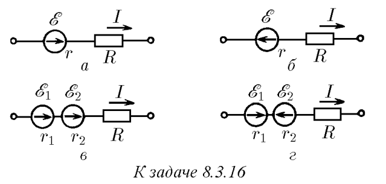
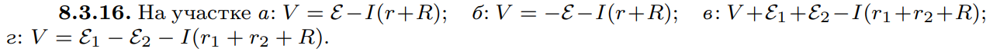

###  Условие: 

$8.3.16.$ В сопротивлении $R$ на единицу прошедшего заряда рассеивается энергия $IR$ независимо от направления тока $I$. Генератор на единицу прошедшего через него заряда передает в цепь энергию (ЭДС) $E$, если направление тока совпадает с направлением напряженности сторонних сил (сторонней силы, отнесенной к единице заряда), и забирает энергию $E$, если их направления противоположны. При прохождении тока через генератор на его внутреннем сопротивлении тоже происходит рассеяние энергии. Используя энергетические соображения, определите разность потенциалов на участках цепей, приведенных на рисунке. 

 

###  Решение: 

 

###  Ответ: 

 
