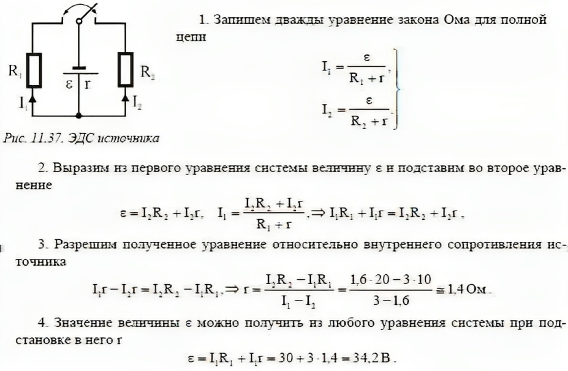

###  Условие: 

$8.3.17.$ Батарея, замкнутая на сопротивлении $10 \,Ом$, дает ток $3 \,А;$ замкнутая на сопротивление $20 \,Ом$, она дает ток $1.6 \,А$. Найдите ЭДС и внутреннее сопротивление батареи. 

###  Решение: 

 

###  Ответ: $E = 34.3 \,В;$ $r = 1.43 \,Ом$ 
