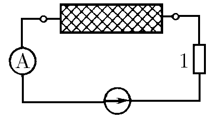
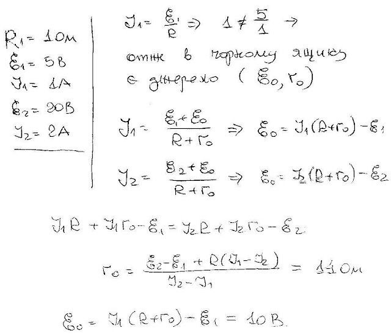

###  Условие:

$8.3.18.$ К ящику с двумя клеммами подключили амперметр, сопротивление $1 \,Ом$ и источник постоянного напряжения $5 \,В$. Амперметр показал ток $1 \,А$. Когда включили другой источник напряжения $20 \,В$, амперметр показал ток $2\,А$. Что находится внутри ящика?

###  Решение:

#### Ответ: Батарея с ЭДС $\varepsilon = 10 \,В$ и внутренним сопротивлением $r = 14 \,Ом$.