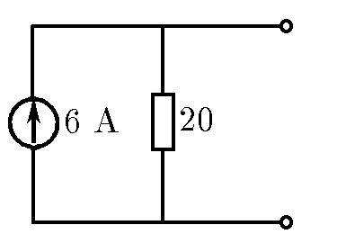

###  Условие:

$8.3.19.$ Идеальным генератором напряжения называется такой генератор, напряжение на котором при любой нагрузке одинаково. Идеальным генератором тока называется генератор, создающий одинаковый ток при любой нагрузке. Какой смысл имеет утверждение: «У идеального генератора тока бесконечное сопротивление, а у идеального генератора напряжение нулевое»? Реальный генератор напряжения теряет энергию на внутреннем сопротивлении, он эквивалентен идеальному генератору напряжения с последовательно присоединенным сопротивлением. Реальный генератор тока имеет конечное сопротивление утечки, он эквивалентен идеальному генератору тока с параллельно присоединенным сопротивлением (шунтом). Изобразите схему генератора тока с внутренним шунтом, эквивалентного генератору с напряжением $120 \,В$ и внутренним сопротивлением $20 \,Ом^{∗)}$

###  Решение:

