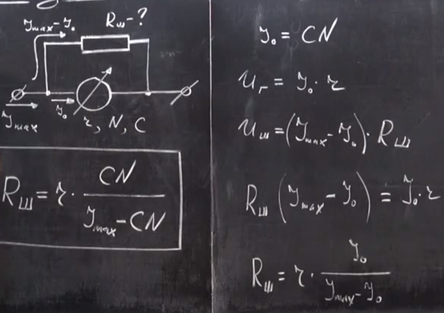
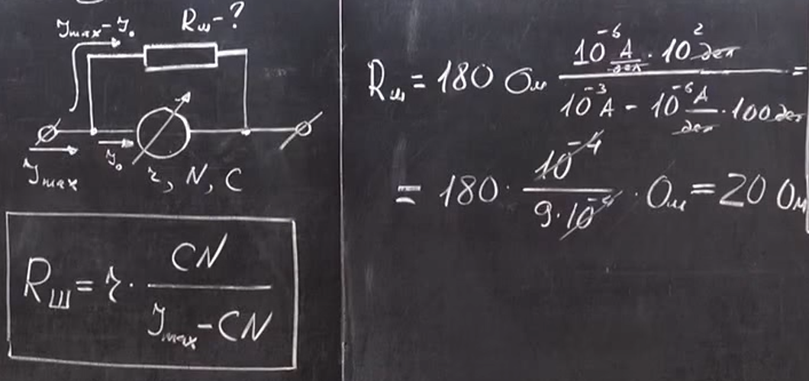

###  Условие:

$8.3.2.$ Какой шунт нужно присоединить к гальванометру, имеющему шкалу на $100$ делений с ценой деления $1 \,мкА$ и внутреннее сопротивление $180 \,Ом$, чтобы им можно было измерять ток до $1 \,мА$?

###  Решение:

#### Ответ: $r = 20 \,Ом$.