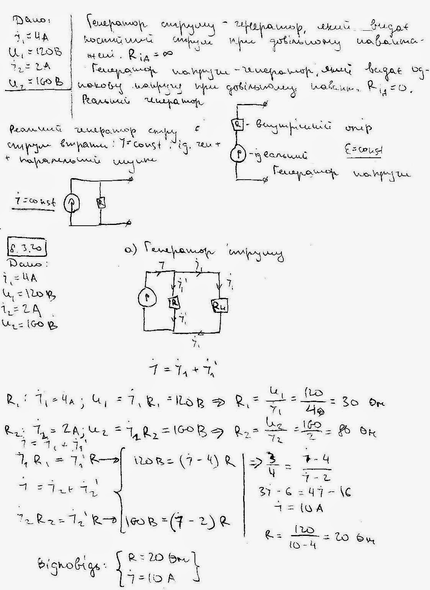
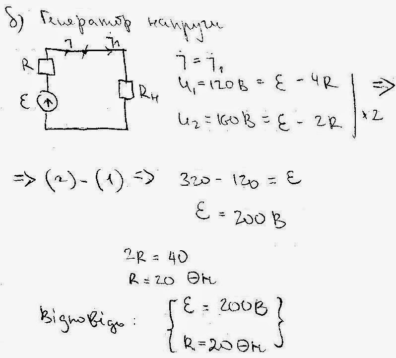

###  Условие:

$8.3.20.$ Генератор с одной нагрузкой дает ток $4 \,А$ при напряжении $120 \,В$, а с другой нагрузкой — ток $2 \,А$ при напряжении $160 \,В$. Найдите параметры эквивалентных схем генератора тока и генератора напряжения.

###  Решение:

#### Ответ: $I=10\mathrm{~A,}$ $r=20\mathrm{~Ом;}$ $\mathcal{E}=200\mathrm{~B,}$ $r=20\mathrm{~Ом.}$