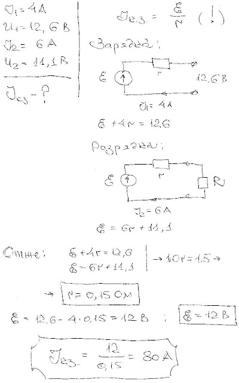

###  Условие:

$8.3.21.$ Через аккумулятор под конец его зарядки течет ток $4 \,А$. При этом напряжение на его клеммах $12.6 \,В$. При разрядке того же аккумулятора током $6 \,А$ напряжение составляет $11.1 \,В$. Найдите ток короткого замыкания.

###  Решение:

#### Ответ: $I = 80 \,А$