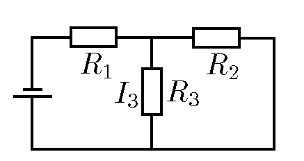

###  Условие: 

$8.3.23.$ Сопротивления $R_1$, $R_2$, $R_3$ в схеме, изображенной на рисунке, и ток $I_3$, протекающий через сопротивление $R_3$, известны. Определите токи через сопротивление $R_1$ и $R_2$ и напряжение на батарее. 

###  Решение: 

Сопротивление между точками 1 и 3: 

$$R_{1-3} = R_{1} + \frac{R_{2}R_{3}}{R_{2}+R_{3}}\tag{1}$$ 

Падение напряжения на клеммах батареи: 

$$\varphi_{1} - \varphi _{3} = U = I_{1} \cdot R_{1-3}\tag{2}$$

Условие стационарности для узла 2: 

$$I_{1} = I_{2} + I_{3}\tag{3}$$

Условие равенства напряжений на сопротивлениях $R_2$ и $R_3$:

$$I_{2}R_{2} = I_{3}R_{3}\tag{4}$$

Из системы уравнений $(1—4)$ находим: 

$$I_{2} = \frac{I_{3}R_{3}}{R_{2}}$$ 

$$I_{1} = I_{3} \frac{R_{2}+R_{3}}{R_{2}}$$ 

$$U = I_{3} \left ( R_{1} + R_{3} + \frac{R_{1}R_{3}}{R_{2}} \right )$$ 

####  Ответ: $I_{2}=I_{3}R_{3}/R_{2};~I_{1}=I_{3}(R_{2}+R_{3})/R_{2};~V=I_{3}(R_{1}R_{2}+R_{1}R_{3}+R_{2}R_{3})/R_{2}$
