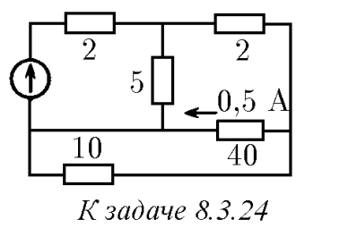
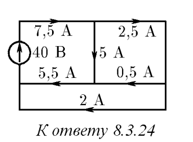

###  Условие: 

$8.3.24.$ В схеме, изображенной на рисунке, указаны сопротивления и ток через одно из сопротивлений. Определите токи через все сопротивления и напряжение генератора. 

 

###  Решение: 

 

 
