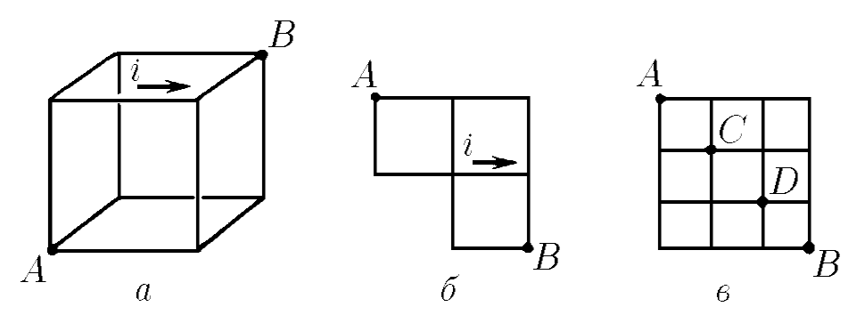
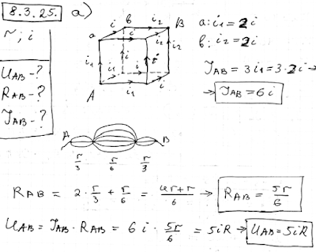
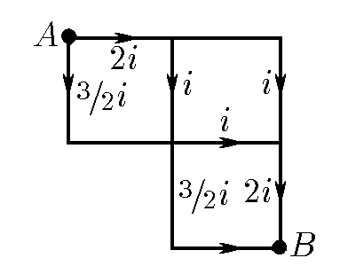
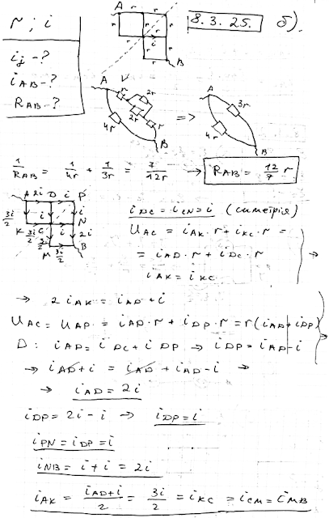
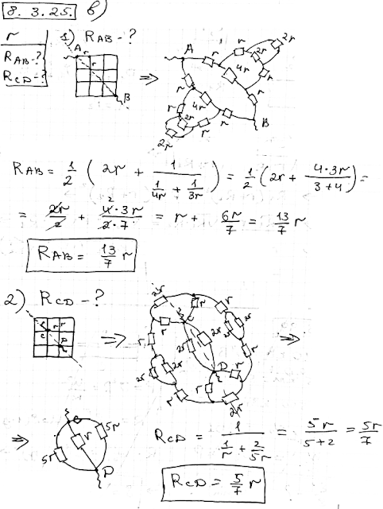

###  Условие:

$8.3.25.$ Используя симметрию схем, решите следующие задачи.
а. Ребра проволочного куба имеют одинаковое сопротивление $r$. Ток в одном ребре $i$. Определите разность потенциалов между узлами $A$ и $B$, сопротивление между этими узлами и полный ток от $A$ к $B$.
б. Определите токи в каждой стороне ячейки, полный ток от узла $A$ к узлу $B$ и полное сопротивление между этими узлами. Сторона каждой ячейки имеет сопротивление $r$, и ток, протекающий по одной из сторон, равен $i$. в. Каждая сторона квадрата имеет сопротивление
в. Определите сопротивление между узлами $A$ и $B$. Чему равно сопротивление между узлами $C$ и $D$?

###  Решение:

#### Ответ: а. $V=5ir;R=5r/6;I=6i.$ $\diamondsuit$б. См. рис. $I=7i/2;R=12r/7;$ в. $R_{AB}=13r/7;R_{CD}=5r/7$