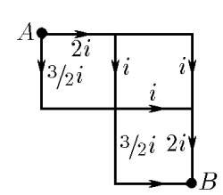
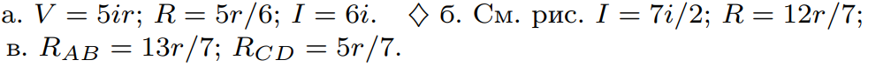

###  Условие: 

$8.3.25.$ Используя симметрию схем, решите следующие задачи. а. Ребра проволочного куба имеют одинаковое сопротивление $r$. Ток в одном ребре $i$. Определите разность потенциалов между узлами $A$ и $B$, сопротивление между этими узлами и полный ток от $A$ к $B$. б. Определите токи в каждой стороне ячейки, полный ток от узла $A$ к узлу $B$ и полное сопротивление между этими узлами. Сторона каждой ячейки имеет сопротивление $r$, и ток, протекающий по одной из сторон, равен $i$. в. Каждая сторона квадрата имеет сопротивление r. Определите сопротивление между узлами $A$ и $B$. Чему равно сопротивление между узлами $C$ и $D$? 

###  Решение: 

 

 

 

 

###  Ответ: 

 
