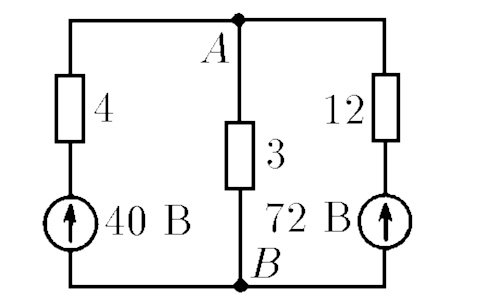
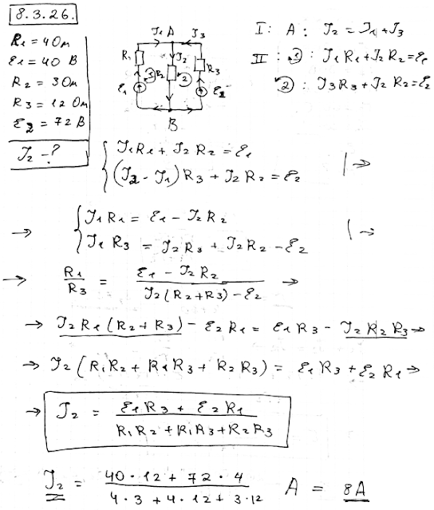

###  Условие: 

$8.3.26.$ При решении задач с несколькими источниками ЭДС можно сначала рассчитать токи, создаваемые каждым источником ЭДС, потом найти полный ток как сумму этих токов. Этот способ вполне законен, если при расчетах принимать во внимание внутреннее сопротивление источников, и называется методом суперпозиции. Определите, используя этот метод, ток между узлами $A$ и $B$. 

###  Решение: 

 

####  Ответ: $I = 8 \,А$ 
