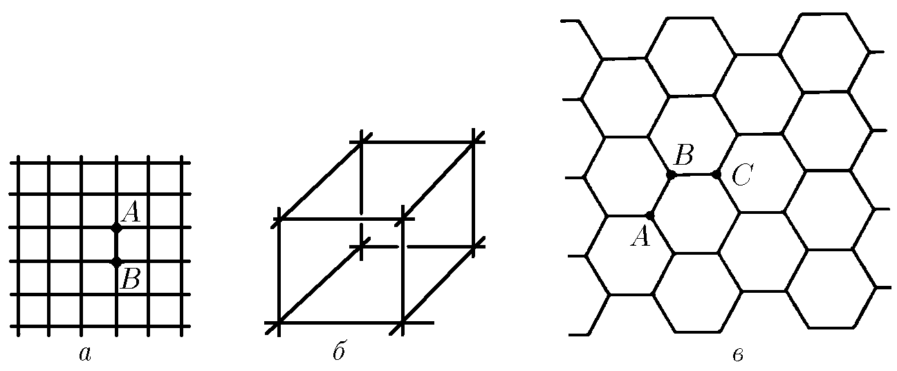

###  Условие:

$8.3.27^*.$ а. Если в бесконечной схеме, состоящей из квадратных ячеек, через один узел $A$ подводят ток $i$, а через соседний узел $B$ отводят ток $i$, то какой ток идет по сопротивлению, соединяющему узлы $A$ и $B$? Каково эквивалентное сопротивление цепи между этими узлами, если сопротивление стороны ячейки $r$? б. Каково эквивалентное сопротивление между соседними узлами бесконечной кубической арматуры, если сопротивление ребра куба $r$? в. Определите сопротивление между узлами $A$ и $B$ двумерной бесконечной сетки с ячейками в виде правильных шестиугольников и узлами $C$ и $A$, расположенными через один соседний узел. Сторона каждой ячейки имеет сопротивление $r$.

###  Решение:

а) Предположим, что напряжение между точками $A$ и $B$ равно $V$, тогда

$$
V=IR=I_0R_0,
$$

где $R$ - сопротивление всей сетки, $I$, ток через сетку и $I_0$, ток через сегмент $AB$. Тогда из симметрии $I/4$ является частью тока, протекающего по всем четырем проволочным сегментам, встречающимся в точке $А$, и аналогично количество тока, протекающего по проводам, встречающееся в $В$, равно $I/4$. Таким образом, ток $I/2$ проходит через проводник $AB$, т.е.

$$
I_0=I_2
$$

Следовательно,

$$
R=\frac{R_0}{2}
$$

#### Ответ: а. $I=i/2;R=r/2.\quad$ б. $R=r/3.\quad$ в. $R_{AB}=2r/3;~R_{AC}=r.$