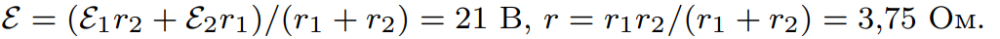

###  Условие: 

$8.3.28.$ Две батареи с ЭДС $\varepsilon_1 = 20 \,В, \,\varepsilon_2 = 30 \,В$ и внутренними сопротивлениями соответственно $r_1 = 4 \,Ом$, $r_2 = 60 \,Ом$ соединены параллельно. Каковы параметры $\varepsilon $ и $r$ генератора, которым можно заменить батареи без изменения тока в нагрузке? 

###  Решение: 

 

###  Ответ: 

 
